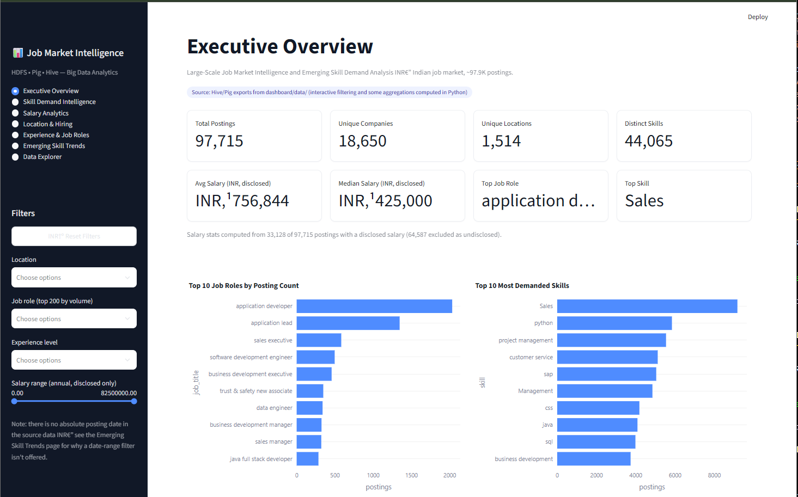
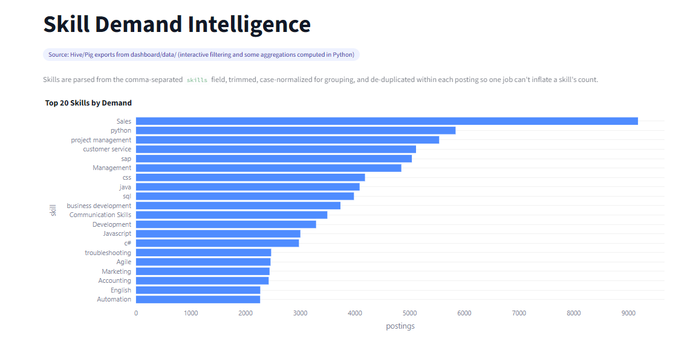

# Job Market Intelligence & Emerging Skill Demand Analysis

A large-scale data pipeline and analytics platform that processes ~97,900
Indian job postings to surface hiring trends, in-demand skills, salary
benchmarks, and location-based hiring patterns — built on **HDFS, Apache
Pig, and Apache Hive**, with an interactive **Streamlit dashboard** as the
presentation layer.

---

## Overview

Raw job-posting data is rarely analysis-ready: inconsistent locations,
free-text skill lists, mixed currencies, undisclosed salaries, and
duplicate records. This project builds a repeatable big-data pipeline that
takes a ~98K-row raw dataset through ingestion, cleaning, large-scale
transformation, and SQL-style analytics — then exposes the results through
a live, filterable dashboard suitable for stakeholders who don't touch the
underlying infrastructure.

**Dataset:** Indian Job Market Dataset 2025 (Naukri-style listings, ~97.9K
postings, 17 raw fields).

## Pipeline Architecture

```
Raw Job Postings (.xlsx)
        ↓
Stage 1 — HDFS Ingestion
  Convert, clean, validate, de-duplicate, load into distributed storage
        ↓
Cleaned & Validated Dataset (/jobmarket/cleaned/jobs_cleaned.csv)
        ↓
Stage 2 — Apache Pig
  Normalize job titles/locations, split multi-value skill fields,
  aggregate by role, location, and skill; compute salary statistics
        ↓
Transformed & Aggregated Data
  (/jobmarket/processed/{jobs,skills,skills_demand,location,salary,salary_location,time_based}/)
        ↓
Stage 3 — Apache Hive
  Structured tables + analytical queries: demand by role/location/skill,
  salary trends, skill co-occurrence, emerging-skill signals
        ↓
Stage 4 — Interactive Dashboard (Streamlit)
  Executive KPIs, skill intelligence, salary analytics, location and
  experience breakdowns, and a searchable data explorer
```

## Repository Structure

```
.
├── dataset/
│   └── indian-job-market-dataset-2025.xlsx   # source dataset
├── task1_hdfs/          # ingestion, cleaning, HDFS load
│   ├── scripts/
│   └── README.md         # full schema contract and cleaning decisions
├── task2_pig/           # large-scale Pig transformations
│   ├── scripts/
│   └── README.md
├── task3_hive/          # Hive tables, analytical queries
│   ├── scripts/
│   └── README.md
├── dashboard/            # interactive Streamlit dashboard (presentation layer)
│   ├── app.py
│   ├── data_loader.py
│   ├── analytics.py
│   ├── charts.py
│   └── README.md
└── README.md             # this file
```

## Data Engineering Stages

### Stage 1 — HDFS Ingestion & Cleaning

Converts the raw Excel export to CSV, applies validation and cleaning
(de-duplication, missing-field checks, salary and experience sanity
checks), and loads the result into HDFS.

Full column definitions, types, and cleaning decisions are documented in
[`task1_hdfs/README.md`](task1_hdfs/README.md) — notably, the `skills`
field is comma-separated, and `posted_raw` (the posting-recency field) is
relative text rather than an absolute date, which shapes how later
time-based analysis is scoped.

```bash
cd task1_hdfs
uv venv && source .venv/bin/activate
uv pip install -r requirements.txt
cd scripts
python3 01_convert_xlsx_to_csv.py
python3 02_clean_data.py
start-dfs.sh
bash 03_hdfs_load.sh
bash 04_verify_hdfs.sh
```

### Stage 2 — Apache Pig Transformations

Reads the cleaned dataset from `/jobmarket/cleaned/jobs_cleaned.csv`,
normalizes job titles and locations, explodes the skills field into
individual rows, and aggregates postings by role, location, and skill —
including salary statistics per group.

```bash
bash task2_pig/scripts/run_task2_pig.sh
```

Outputs land in `/jobmarket/processed/{jobs,skills,skills_demand,location,salary,salary_location,time_based}/`.

### Stage 3 — Apache Hive Analytics

Builds Hive tables (`jobs`, `job_skills`, `job_locations`, `job_salary`,
`salary_by_location`, `skills_demand`, `time_based`, `skill_trends`) over
the Pig output and runs the core analytical queries: top roles and skills,
demand by location, salary benchmarking by role/location, and skill-demand
patterns over the available time signal.

Implementation notes and query details: [`task3_hive/PROJECT_STATUS.md`](task3_hive/PROJECT_STATUS.md).

### Stage 4 — Interactive Dashboard

A self-contained Streamlit application in [`dashboard/`](dashboard/) that
presents the pipeline's results through seven pages: Executive Overview,
Skill Demand Intelligence, Salary Analytics, Location & Hiring, Experience
& Job Roles, Emerging Skill Trends, and a filterable Data Explorer with CSV
export.

The dashboard runs standalone — **it does not require Hadoop, Pig, or Hive
to be running.** By default it reads the raw dataset and applies the exact
Stage 1 cleaning contract in-process; if real Hive/Pig exports are placed
in `dashboard/data/`, it uses those instead and makes the active data
source visible in the UI at all times.

```powershell
cd dashboard
python -m venv .venv
.\.venv\Scripts\Activate.ps1
pip install -r requirements.txt
streamlit run app.py
```

Open **http://localhost:8501**. Full page-by-page documentation and data
adapter format: [`dashboard/README.md`](dashboard/README.md).

## Environment Setup

Hadoop, Pig, and Hive are assumed installed and available on `PATH`
(tested under WSL). Python dependencies for the ingestion stage are
managed with `uv`:

```bash
cd task1_hdfs
uv venv
source .venv/bin/activate
uv pip install -r requirements.txt
cd ..

start-dfs.sh   # start HDFS before running Stage 1 scripts
jps            # confirm NameNode / DataNode are up
```

If `start-dfs.sh` reports `Connection refused` on a later command, HDFS
hasn't finished starting; a `Name node is in safe mode` message right after
startup typically clears within 15–30 seconds (or run
`hdfs dfsadmin -safemode leave`).

## Data Integrity Principles

- No fabricated statistics: every KPI, chart, and figure is computed from
  actual data, never hardcoded or estimated.
- Undisclosed salaries are excluded from salary statistics rather than
  treated as zero, and the number of excluded records is always disclosed.
- Different currencies (INR/USD) are never averaged together.
- Skill extraction is transparent and documented — normalized for
  case/whitespace, de-duplicated within a posting, with alias mappings
  disclosed rather than hidden.
- Where the data cannot support a claim (e.g. a true multi-year
  "emerging skill" trend, given the dataset's relative-text posting
  recency field rather than an absolute date), the limitation is stated
  explicitly instead of being papered over.

## Version Control Notes

`.gitignore` excludes generated and environment-specific files (virtual
environments, raw/cleaned data exports, Hadoop/Hive/Pig logs) so the
repository carries source code, scripts, and documentation rather than
multi-hundred-megabyte data artifacts.

```bash
git add .
git status   # confirm no data files or virtual environments are staged
git commit -m "Describe what changed"
git push
```

If a data file or virtual environment was committed before `.gitignore`
excluded it, remove it from tracking (this does not delete the local
file):

```bash
git rm -r --cached task1_hdfs/.venv data/raw/*.csv data/raw/*.xlsx data/cleaned/*.csv 2>/dev/null
git commit -m "Remove generated files from version control"
git push
```

After cloning fresh, regenerate the cleaned dataset locally with the Stage
1 scripts, or pull it directly from HDFS if a cluster is already running:

```bash
hdfs dfs -get /jobmarket/cleaned/jobs_cleaned.csv data/cleaned/
```

## Tech Stack

| Layer | Technology |
|---|---|
| Distributed storage | HDFS |
| Large-scale transformation | Apache Pig |
| Analytical queries | Apache Hive |
| Dashboard | Streamlit, Plotly |
| Data processing | Python, Pandas |

## Screenshots

_Add dashboard screenshots here, e.g.:_




